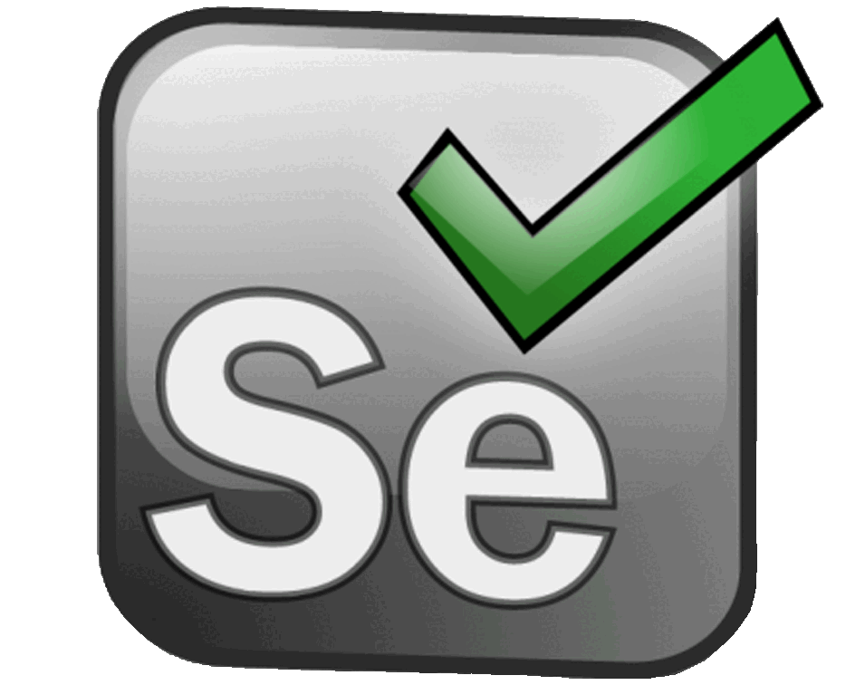
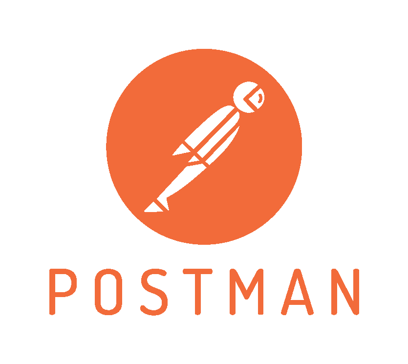
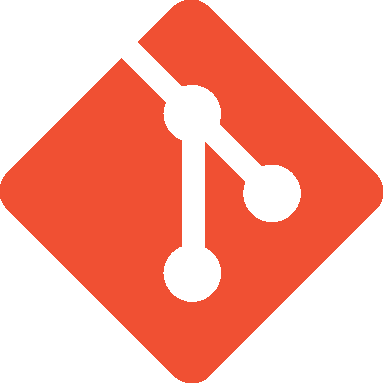
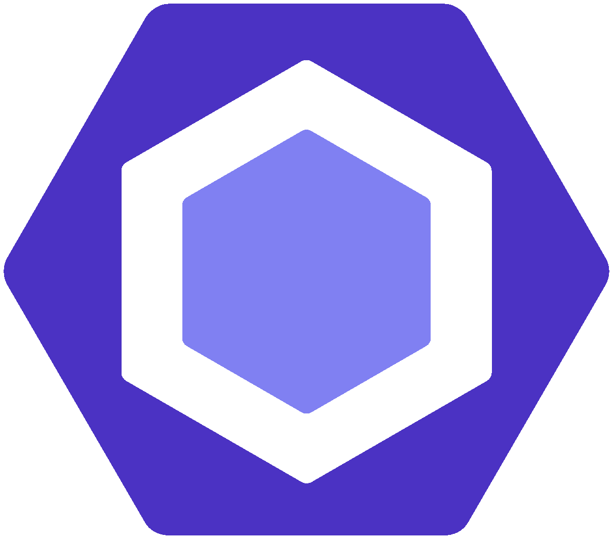
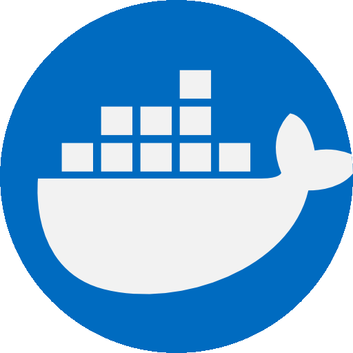

<h1 align="center">Sandro Santos</h1>

<h4 align="center">

</h4>

 

# **# About Me:**

### **Hi, Welcome to my GitHub Profile!**

I´m a Junior QA Engineer with a Post-Graduation in **<abbr title="Software Quality Assurance">Software QA</abbr>** from **<a href="https://www.isep.ipp.pt/Department/Department/14">ISEP-DEI</a>**, as part of the "Switch-QA" program sponsored by **<a href="https://portotechhub.com/">Porto TechHub</a>**. Currently giving my first steps in the IT world, after a career change from the Engineering field as Design Engineer and Consultant for the Automotive and Defense Industries for almost a decade.

Below you´ll find some complementary information that will give a more indepth view of the technologies, frameworks, principles and architectures i´m familiarized with, as well as some of the most relevant projects I´ve developed or had the pleasure to be part of.

Always keen to collaborate in interesting projects and talk with other IT professionals and passionates, so feel free to connect with me on LinkedIn.

### **Let´s Connect**

 
 
 

# # Projects:

- In this section you´ll find a collection of some of the most relevant projects I´ve worked on more recently.
- This includes a variety of projects ranging from Web Applications, REST APIs, to Games and Utilitary Apps.

 

|                                                                                                                                     |                                                                                                                                             |
| ----------------------------------------------------------------------------------------------------------------------------------- | ------------------------------------------------------------------------------------------------------------------------------------------- |
| **# DDD Forum App**                                                                                                                 | **# Invictus Rental App**                                                                                                                   |
|        |  |
| **# Image Converter App**                                                                                                           | **# REST API**                                                                                                                              |
|  |                               |
| **# N-SYNC**                                                                                                                        | **# Tetris Game**                                                                                                                           |
|                             |                      |
|                                                                                                                                     |                                                                                                                                             |

 
 
 

# # SkillSet:

- Architectures: MVC, DDD

- Methodologies: BDD, TDD

- Key Concepts and Technologies: OOP, RESTful Web Services, Agile, Scrum.

 

- **Software development for Web Services and Web Applications:**
  > - Frontend development.
  > - Backend development.

 

- **Software Testing and Quality Assurance:**

  > - **Testing Approaches:**
  >   > - Manual Testing
  >   > - Automated Testing
  >   > - Black Box Testing
  >   > - White Box Testing
  >   > - Exploratory Testing
  > - **Testing Types:**
  >   > - Unit Testing
  >   > - Smoke Testing
  >   > - Functional Testing
  >   > - Regression Testing
  >   > - Integration Testing
  >   > - Non-Functional Testing (Performance, Load, throughput, capacity, security)
  >   > - User Acceptance Testing
  >   > - Structural Testing

 
 
 

# # Technology Stack:

> ### **Testing & QA:**

&nbsp;&nbsp;&nbsp;&nbsp;&nbsp;&nbsp;&nbsp;
&nbsp;&nbsp;&nbsp;&nbsp;&nbsp;&nbsp;&nbsp;
&nbsp;&nbsp;&nbsp;&nbsp;&nbsp;&nbsp;&nbsp;
&nbsp;&nbsp;&nbsp;&nbsp;&nbsp;&nbsp;&nbsp;
&nbsp;&nbsp;&nbsp;&nbsp;&nbsp;&nbsp;&nbsp;
&nbsp;&nbsp;&nbsp;&nbsp;&nbsp;&nbsp;&nbsp;
&nbsp;&nbsp;&nbsp;&nbsp;&nbsp;&nbsp;&nbsp;
&nbsp;&nbsp;&nbsp;&nbsp;&nbsp;&nbsp;&nbsp;
&nbsp;&nbsp;&nbsp;&nbsp;&nbsp;&nbsp;&nbsp;

> ### **Version Control:**

&nbsp;&nbsp;&nbsp;&nbsp;&nbsp;&nbsp;&nbsp;
&nbsp;&nbsp;&nbsp;&nbsp;&nbsp;&nbsp;&nbsp;

> ### **CI / CD:**

&nbsp;&nbsp;&nbsp;&nbsp;&nbsp;&nbsp;&nbsp;
&nbsp;&nbsp;&nbsp;&nbsp;&nbsp;&nbsp;&nbsp;
&nbsp;&nbsp;&nbsp;&nbsp;&nbsp;&nbsp;&nbsp;

> ### **Frontend Development:**

&nbsp;&nbsp;&nbsp;&nbsp;&nbsp;&nbsp;&nbsp;
&nbsp;&nbsp;&nbsp;&nbsp;&nbsp;&nbsp;&nbsp;
&nbsp;&nbsp;&nbsp;&nbsp;&nbsp;&nbsp;&nbsp;
&nbsp;&nbsp;&nbsp;&nbsp;&nbsp;&nbsp;&nbsp;
&nbsp;&nbsp;&nbsp;&nbsp;&nbsp;&nbsp;&nbsp;
&nbsp;&nbsp;&nbsp;&nbsp;&nbsp;&nbsp;&nbsp;
&nbsp;&nbsp;&nbsp;&nbsp;&nbsp;&nbsp;&nbsp;

> ### **Backend Development:**

&nbsp;&nbsp;&nbsp;&nbsp;&nbsp;&nbsp;&nbsp;
&nbsp;&nbsp;&nbsp;&nbsp;&nbsp;&nbsp;&nbsp;
&nbsp;&nbsp;&nbsp;&nbsp;&nbsp;&nbsp;&nbsp;
&nbsp;&nbsp;&nbsp;&nbsp;&nbsp;&nbsp;&nbsp;
&nbsp;&nbsp;&nbsp;&nbsp;&nbsp;&nbsp;&nbsp;

> ### **Database:**

&nbsp;&nbsp;&nbsp;&nbsp;&nbsp;&nbsp;&nbsp;

> ### **Infrastructure:**

&nbsp;&nbsp;&nbsp;&nbsp;&nbsp;&nbsp;&nbsp;
&nbsp;&nbsp;&nbsp;&nbsp;&nbsp;&nbsp;&nbsp;

> ### **OS:**

&nbsp;&nbsp;&nbsp;&nbsp;&nbsp;&nbsp;&nbsp;
&nbsp;&nbsp;&nbsp;&nbsp;&nbsp;&nbsp;&nbsp;

 

&copy;&nbsp;<a href="https://github.com/sandroffdsantos">Sandro Santos</a>

